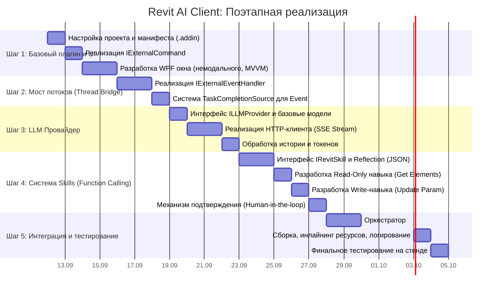

# Дорожная карта реализации: Revit AI Client

## План работ (Gantt Chart)

## Пошаговый план для оператора

- [ ] **Шаг 1: Базовый каркас.** Создание `.csproj`, манифеста типа Command, реализация команды и пустого немодального WPF-окна. *(Проверка: команда запускается через Add-In Manager, немодальное окно открывается и не блокирует Revit).*
- [ ] **Шаг 2: Потокобезопасность.** Реализация и тестирование `IExternalEventHandler`. *(Проверка: тестовая кнопка в WPF асинхронно вызывает чтение ID элемента из Revit без блокировки UI).*
- [ ] **Шаг 3: Интеграция LLM.** Подключение к API (например, DeepSeek/OpenAI), реализация чата. *(Проверка: чат стримит текстовые ответы).*
- [ ] **Шаг 4: Инфраструктура Skills.** Регистрация базового навыка (например, `GetActiveViewInfo`), передача схемы в LLM. *(Проверка: LLM вызывает навык, ловит ответ, выводит результат в чат).*
- [ ] **Шаг 5: Безопасность и запись.** Добавление навыка изменения модели с запросом подтверждения. *(Проверка: LLM пытается изменить параметр, UI запрашивает Approve, после подтверждения транзакция выполняется).*